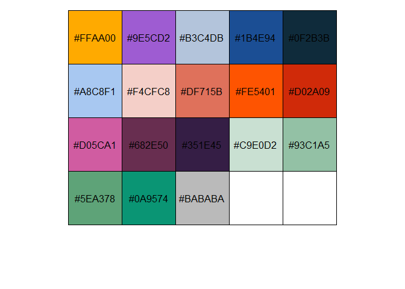

<!-- README.md is generated from README.Rmd. Please edit that file -->

# TBtheme

<!-- badges: start -->

<!-- badges: end -->

The TBtheme is an other theme for ggplot2

## Installation

You can install the latest version of the `TBtheme` packege from
[GitHub](https://github.com/) with:

``` r
# install.packages("devtools")
devtools::install_github("tbobin/TBtheme")
```

## Example

All the colors

``` r
library(TBtheme)
library(ggplot2)

# current verison
packageVersion("TBtheme")
#> [1] '0.0.9000'

scales::show_col(tb_pal()(18))
```


